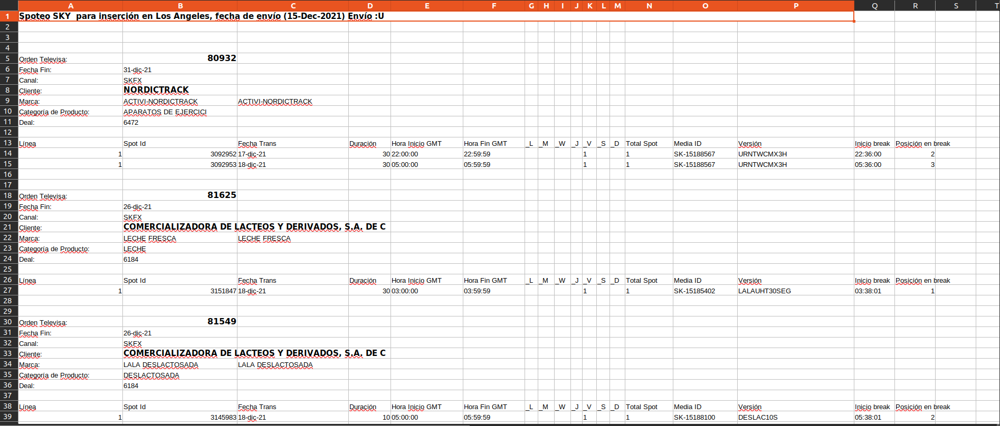
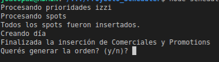
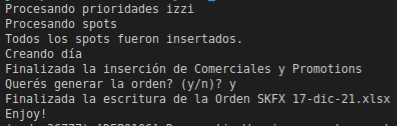
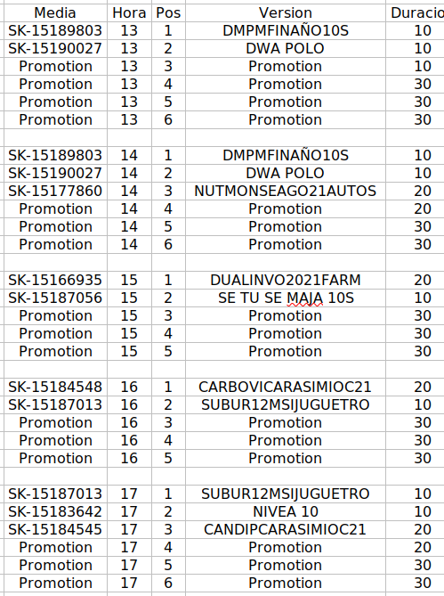

# Scheduler

The purpose of this Node JS program (runned by Scheduler.exe) is to generate an organized 24 hour Schedule for the Sales Team to insert specific commercial spots and to add Promotion (fillers) in between hours that have not been sold. The program is commented and written in Spanish per the client Company requirements.

- The input file must be saved as Orden.xlsx and the output will be 'Orden CHANNEL_NAME DATE_IN_SPANISH_FORMAT'.xlsx.
- This program also allows to check if the specific channel's playlist has been built correctly, by providing an export file from the channel (right out of the IBMS system used in a specific company for which this program was built)
- To run the checker a file named Export.txt must be present and the original purchase order saved in the same folder as Orden.xlsx.
- If Orden.xlsx and Export.txt are present, this console based program will ask at the end of the generation of the schedule if you want to run the checker, Y runs it.

## Node packages used:

> NODE-XLSX -> To interact with the XLSX files  
> FS -> Read and write in the FileSystem  
> CLI-INTERACT -> To query the user in the Console for Yes or No questions

## Example

In the Demo folder you'll find Orden.xlsx (a sales order detailing the commercial spots hired) that looks like this

We open Scheduler.exe (which has to be in the same folder)

If everything is OK the program will ask us a yes or no question (Y/N), if we want to generate the schedule (Orden CHANNELNAME DD/MM/YY.xlsx)

After the Enjoy! message we will now see in the original folder a new .xlsx has been generated following the Orden CHANNELNAME DD/MM/YY .xlsx format.

 

#### This is the final schedule in .xlsx format

This final form will have a 24 hour schedule that starts at 7 am and ends at 6 am (per the Client's requirement). This could be ingested into a system to automate the Schedule generation for channels, replacing Promotion with fillers and the specific paid for commercials will be assigned by their Media Id.

- First column states the Media ID that the system will use to allocate the Video File
- Hora is the time (24 hrs format) to be inserted in
- Pos is the position inside of the time lapse
- Version is the alias for the video file (an easily unique name the sales team uses to refer to the media)
- Duracion is the duration in seconds of the video file

## Algorithmic Rules

> - There can't be more than 2 minutes (120 seconds) worth of media in a time lapse
> - If the free time (time not filled by commercial spots bought) is more than 30 seconds, then 30 seconds fillers must be added, if the time is less than 30, it must be a 10, 5, 15 or 20 seconds filler.
> - Since the system doesn't have access to fillers (only info provided is commercials bought) it must fill with fillers named Promotion, so that another system replaces Promotions with random fillers
> - The output must be minimal information needed for human operators with Microsoft Office level skills can interpret, assign and fix if human intervention is to be required

## Modules created

> Helper.js are JSON read/write helper functions.
>
> Importador.js processes the XLSX into a buffer, extracts the information and generates the Commercial Spots object.
>
> Chequer.js runs the checking process for the correct insertions of the files according to Export.txt (generated by the IBMS system the traffic and automation people use in the company).
>
> Scheduler generates the schedule (day) object and fills it following the algorithmic requirements.
